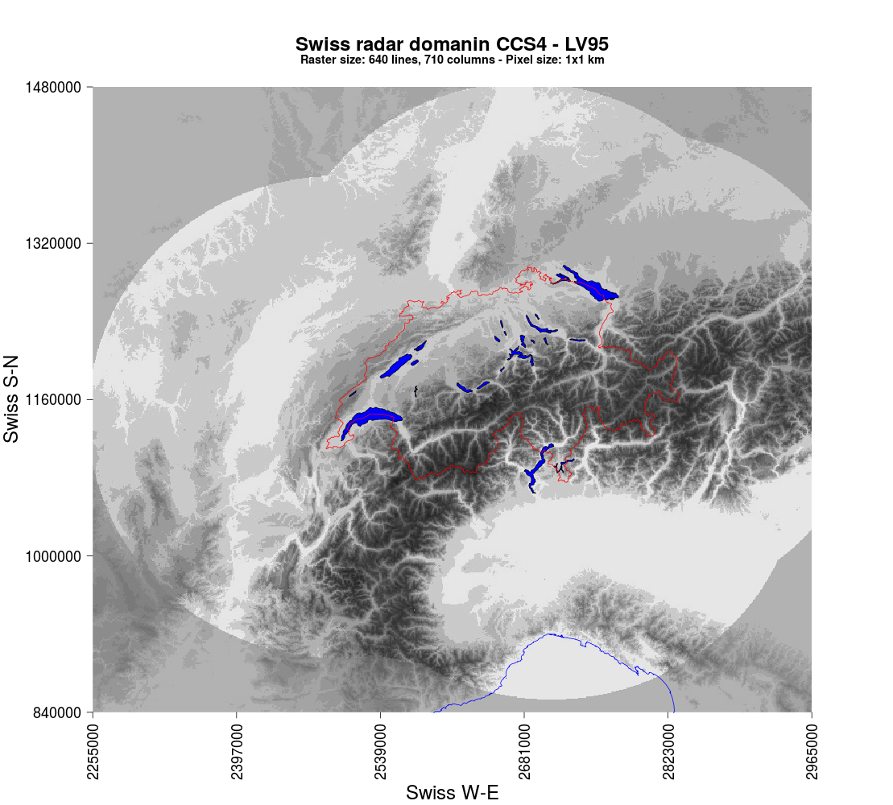

# MeteoSwiss Radar Data Domain (Gen 4)

Source: [Downloads Dataset MeteoSwiss Weather Radar Network](https://www.meteoswiss.admin.ch/weather/measurement-systems/atmosphere/weather-radar-network.html)

## Specifications

- Pixel size: 1x1 km
- Dimensions: 640 x 710 (columns x rows)
- Domains: PRECIP, CAPPI, POH, MESHS

## LV95 Coordinates

- Lower-left: 840000, 2255000
- Upper-right: 1480000, 2965000

## Projection

PROJ string:

`+proj=somerc +lat_0=46.95240555555556 +lon_0=7.439583333333333 +k_0=1 +x_0=2600000 +y_0=1200000 +ellps=bessel +towgs84=674.374,15.056,405.346,0,0,0,0 +units=m +no_defs`

(see [proj.org](https://proj.org/en/stable/) for more information)

Explanation of the PROJ string by GitHub Copilot:

- `+proj=somerc`: Uses the Swiss Oblique Mercator projection.
- `+lat_0=46.95240555555556`: Latitude of the origin.
- `+lon_0=7.439583333333333`: Longitude of the origin.
- `+k_0=1`: Scale factor at the origin.
- `+x_0=2600000`: False easting.
- `+y_0=1200000`: False northing.
- `+ellps=bessel`: Specifies the Bessel 1841 ellipsoid.
- `+towgs84=674.374,15.056,405.346,0,0,0,0`: Transformation parameters to WGS84.
- `+units=m`: Units in meters.
- `+no_defs`: No additional definition files.
