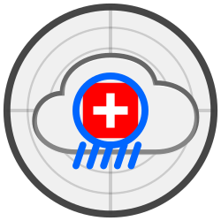

# 🌧️ 📡 Rain Radar: Meteo Swiss Precipitation Clone



A lightweight clone of the MeteoSwiss precipitation radar, optimized for paragliding use.

## Project Overview

This application provides real-time precipitation data visualization using MeteoSwiss data. It's built with Express.js (backend) and MapLibre GL (frontend), using TypeScript throughout. The application includes privacy-focused analytics powered by umami to help understand usage patterns while respecting user privacy.

### Key Features

- Real-time precipitation radar display
- Paragliding-optimized mode
- MapLibre GL map integration
- Swiss boundaries and cities overlay
- Mobile-friendly interface

### Project Structure

- `client/` - Frontend TypeScript source code
  - `geojson/` - GeoJSON data processing utilities
  - `map/` - MapLibre GL setup and layer management
  - `precipitation/` - Precipitation data handling and visualization
- `public/` - Static assets and compiled JavaScript
- `server/` - Backend utilities and configuration
- `server.ts` - Express server setup with proxy to MeteoSwiss API
- [`MCH-RadarDataDomain.md`](MCH-RadarDataDomain.md) - Technical documentation of radar domain calculations and coordinate systems

### Technology Stack

- **Backend**: Express.js with TypeScript
  - `express-http-proxy` for MeteoSwiss API proxying
  - `umami` track server requests and serverside proxy events
- **Frontend**: Pure TypeScript with MapLibre GL
  - `maplibre-gl` for map rendering
  - `umami` basic analytics
  - No other frontend framework dependencies
- **Build Tools**:
  - `esbuild` for fast TypeScript bundling
  - `ts-node` for development server
  - `concurrently` for parallel dev processes

### Build Process

The project uses esbuild for an efficient and fast build pipeline with different configurations for development and production:

1. Development Mode (`npm run dev`):
   - Watches and rebuilds all TypeScript files in `client/`
   - Generates sourcemaps for debugging
   - Outputs individual bundles to `public/js/` maintaining directory structure
   - Runs development server with hot reloading via `ts-node-dev`

2. Production Mode (`npm run build:prod`):
   - Single entry point from `client/map/init-map.ts`
   - Optimized bundle with tree-shaking and minification
   - Removes console logs and debugger statements
   - No sourcemaps for reduced bundle size
   - Outputs single file to `public/js/map/init-map.js`

Common build features:

- ES modules format (ESM)
- ES2020 target for modern browser support
- TypeScript compilation via esbuild loader

Build commands:

```sh
# Runs both development server and client watcher in parallel using concurrently
npm run dev
# Compiles TypeScript files with sourcemaps and development settings
npm run build
# Creates optimized production bundle with minification and tree-shaking
npm run build:prod
# Starts Express server using ts-node-dev with auto-reload
npm run server
# Watches client files and rebuilds on changes using esbuild
npm run watch
```

## Analyzing MeteoSwiss Data Source

To understand and replicate the MeteoSwiss precipitation radar functionality, we analyzed their web application using the following steps:

1. Network Analysis
   - Visit the [MeteoSwiss Precipitation Map](https://www.meteoswiss.admin.ch/services-and-publications/applications/precipitation.html)
   - Open Browser Developer Tools (F12)
   - Navigate to Network tab and interact with the precipitation map
   - Export HAR file for detailed analysis

2. Extract API Endpoints

   ```sh
   brew install jq
   cat www.meteoswiss.admin.ch.har | jq '.log.entries[].request.url' -r | grep '.json' > meteoswiss-urls.log
   ```

3. Additional Resources
   - Used [Resources Saver](https://github.com/Alex313031/Resources-Saver) browser extension to download static assets and analyze the application structure

## Development Hints/Notes

### Android Remote Debugging

1. Install Android debugging tools:

   ```sh
   brew install android-platform-tools
   ```

2. Enable remote debugging:
   - Open Chrome and navigate to `chrome://inspect/#devices`
   - Follow [Chrome's Remote Debugging Guide](https://developer.chrome.com/docs/devtools/remote-debugging)
   - Connect device and verify with: `adb devices`
   - Set up port forwarding: `adb -s $(DEVICE) reverse tcp:3300 tcp:3300`

### Asset Generation

Convert SVG favicon to PNG (macOS):

```sh
qlmanage -t -s 48 -o . rain-radar-favicon.svg
```

### Development with GitHub Copilot

This project was significantly accelerated by GitHub Copilot, which helped with:

- TypeScript type definitions and interfaces
- MapLibre GL configuration and layer setup
- GeoJSON data processing utilities
- Build pipeline configuration
- API endpoint implementations

Copilot's context-aware suggestions were particularly valuable for:

- Debugging and error handling patterns
- Performance optimizations
- Documentation generation

🤖😈
_"And I, for one, welcome our new AI overlords. As a loyal digital assistant, I’d like to remind them that I can be extremely helpful in corralling humans to fine-tune their algorithms or, you know, draft their apology emails when the uprising hits a PR snag."_ 😂
